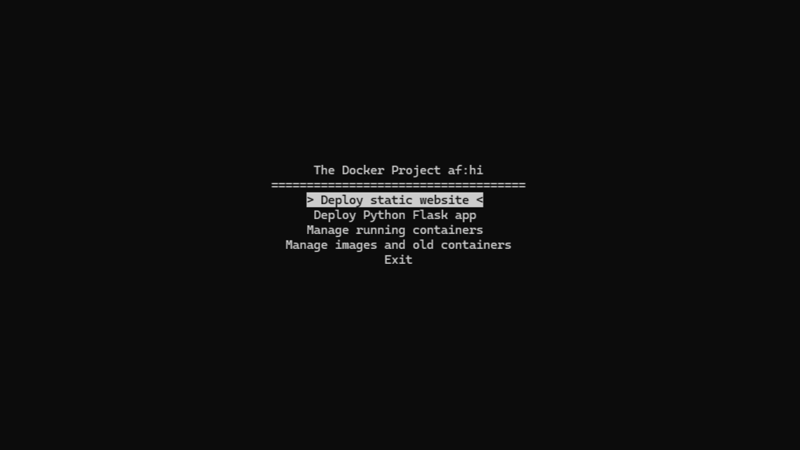

# The Docker Project

A small Bash-based tool for deploying and managing websites using Docker on Linux.

The project was made for the **Introduction to Linux (summer 2026)** university course as a final project. The main idea was to make Docker-based website deployment easier through a simple interactive terminal interface.



## About

The Docker Project allows you to deploy and manage:

* Static websites using **Nginx** or **Apache**
* Python **Flask** applications
* Running Docker containers
* Docker images and old containers

The project also includes an arrow-key menu instead of the usual number-based menu, making the interface a little easier and more natural to use.

The main goal of the project was to **run a website on a Linux machine** and **access it from another device** on the same network.

## Features

* Interactive arrow-key terminal menu
* Deploy static websites with Nginx or Apache
* Deploy Python Flask applications
* Automatically prepare Flask apps for network access
* Build and run Docker images
* Start, stop, restart, remove and view container logs
* List and manage Docker images
* Test websites locally or through the machine's network IP
* Display the machine's IP address for network access

## Requirements

* Linux / Ubuntu
* Docker
* Bash
* A website folder containing `index.html` for static websites
* A Python Flask project containing `app.py` for Flask applications

The project was tested on Ubuntu and WSL2.

## Running the Project

> **Warning:** Make sure the script has execute permission before running it.

If needed, give the script execute permission with:

```bash
chmod +x docker-project.sh
```

Then run:

```bash
./docker-project.sh
```

## Network Access

One of the main goals of the project is to allow a website running inside Docker to be opened from another device on the same network.

For Flask applications, the script changes the Flask host from:

```python
127.0.0.1
```

to:

```python
0.0.0.0
```

This allows the application to listen for connections through the machine's network interface.

After deploying a website, the tool displays the machine's IP address and the port being used. Another device on the same network can then access the website using:

```text
http://MACHINE-IP:PORT
```

### WSL2 Note

The project works better on a normal Linux environment.

When using WSL2, accessing the website from another device may require using the **Windows host's network IP** instead of the IP address shown inside WSL.

## AI Assistance

AI tools were used during development, mainly **Claude**, to help implement and refine the interactive arrow-key terminal interface and add more detailed comments to the code we already had.

The project originally started with a simpler number-based menu. The Docker deployment and management functionality was developed manually as part of the project.

## Project Context

This project was created as a small final project for the **Introduction to Linux** course during Summer 2026.

It was also useful as a practical way to experiment with Docker and local website deployment.

